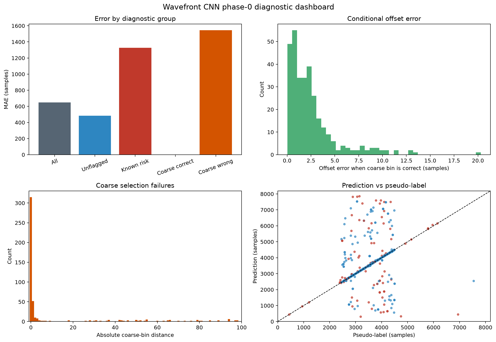
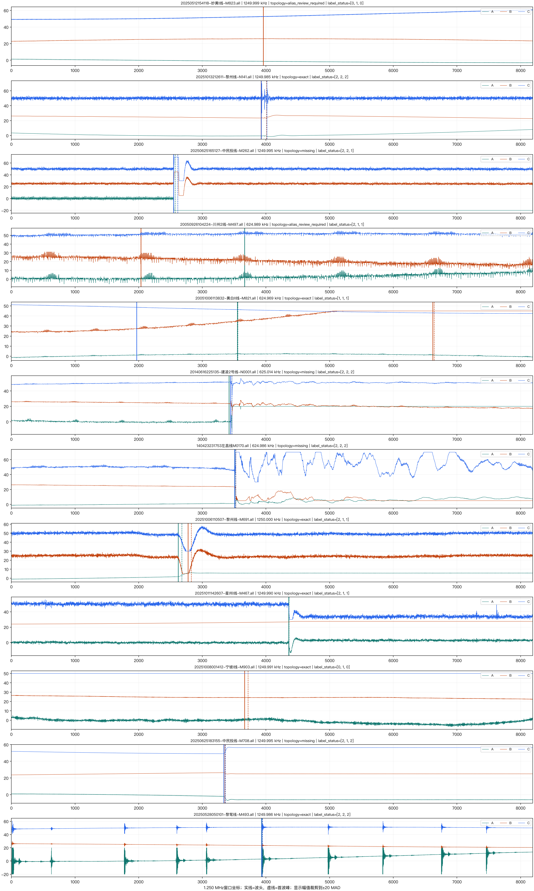
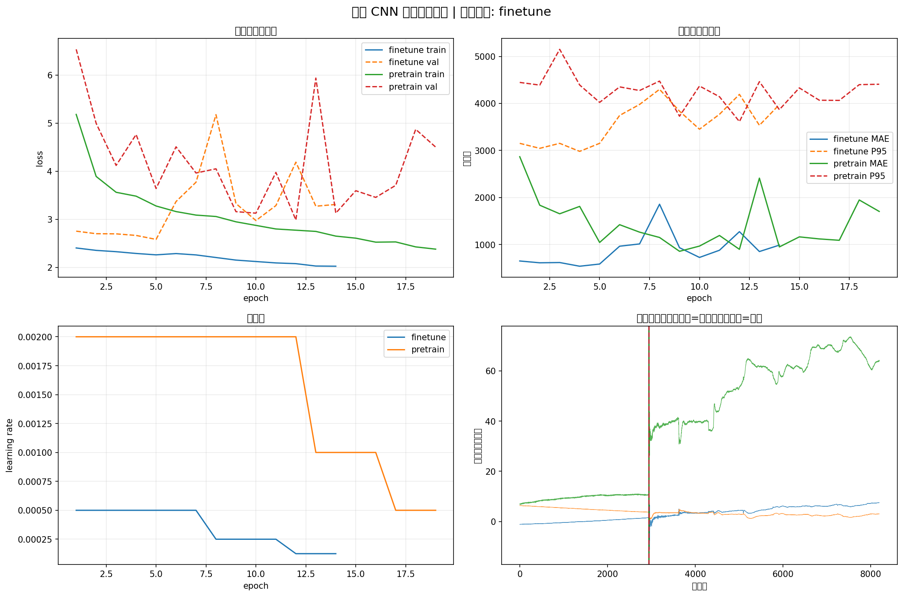
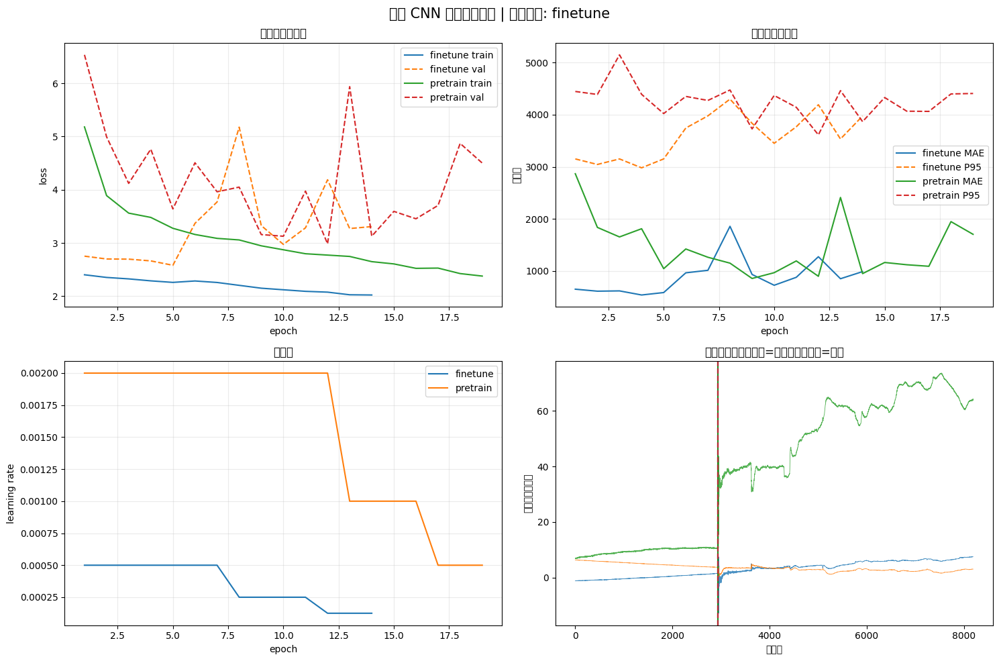
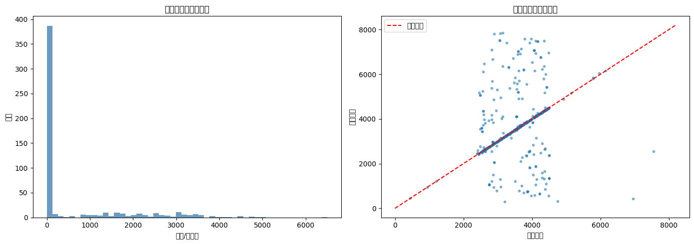
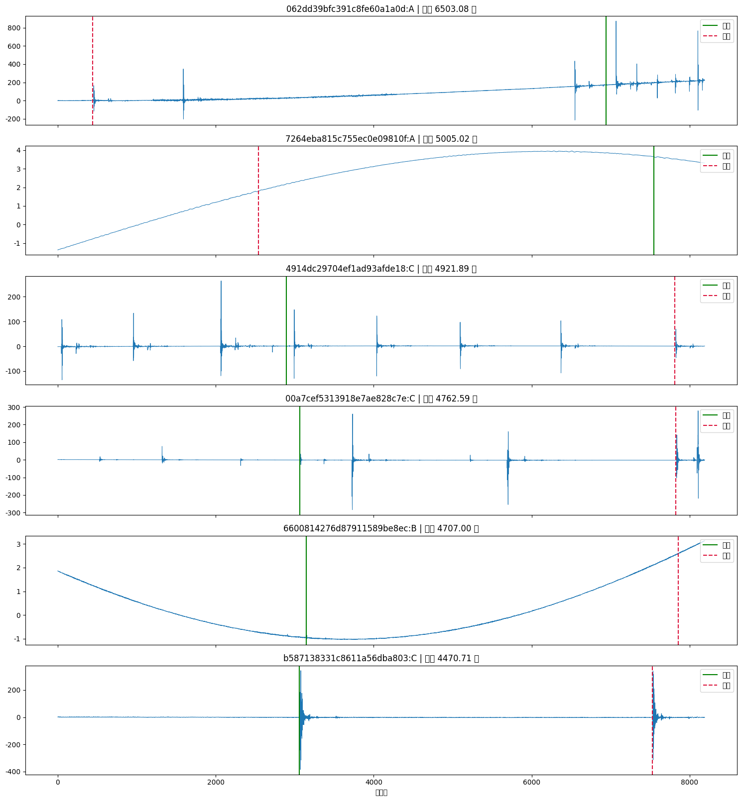

# 基于 CNN 的行波波头检测研究

本仓库用于沉淀输电线路故障行波波头检测的机器学习实验、阶段诊断报告和后续工程化开发路线。当前版本的重点不是发布可部署模型，而是保留一套可复现的 CNN 基线、明确当前失败根因，并给出下一阶段“候选波头生成 + CNN 判别排序 + 电气物理约束”的开发方向。



## 项目结论

当前 CNN 粗到细定位模型已经完成训练和阶段 0 自动诊断，但不建议直接作为故障测距工程模型使用。主要原因如下：

- 测试集 hard label 来自自动伪标签，评价结果更多是在衡量模型是否模仿当前自动标注器，而不是是否找到真实初始行波波头。
- 数据窗口由标签位置参与裁剪，形成了不可部署的位置先验；上线推理时无法预先知道真实波头坐标。
- 多峰、反射波、后续强脉冲场景中，当前全局 argmax 解码容易跳到错误候选。
- 三相一致性和双端线路物理约束尚未进入监督闭环。

阶段 0 诊断给出的直接机制是：灾难误差主要来自粗候选/bin 选择错误；当粗 bin 选对时，offset 头已经能达到较小误差。因此后续优化应优先解决候选召回、首波排序和物理约束，而不是单纯增大 CNN 或继续调参。

## 当前关键指标

| 项目 | 结果 |
|---|---:|
| 数据窗口规模 | 2587 个事件，3 相，8192 点 |
| 统一采样率 | 1.25 MHz |
| 测试样本 | 543 个相级 hard 伪标签 |
| 测试 MAE | 649.90 samples / 519.92 us |
| 测试 P95 | 3313.67 samples / 2650.94 us |
| within 4 samples | 48.62% |
| 粗 bin Top-1 | 58.01% |
| 粗 bin Top-3 | 82.14% |
| 选对 bin 后 offset MAE | 2.53 samples |
| 选错 bin 后整体 MAE | 1544.29 samples |
| 已知风险组 MAE 增量 | +844.21 samples |

更多细节见：

- [波头 CNN 训练结果与根因分析](docs/reports/wavefront_cnn_results_root_cause_analysis.md)
- [波头检测优化可行性方案](docs/reports/wavefront_detection_optimization_plan.md)
- [阶段 0 诊断报告](wavefront_stage0_analysis/波头CNN阶段0诊断报告.md)

## 图片与结果展示

### PyQt Gold 标注客户端

阶段 1 数据集 v2 重建配套的人工 Gold 标注客户端已放入 [annotation_tool](annotation_tool)，支持 `.all/.vall` 三相波形浏览、自动伪标签对照、卡尺标注、框线区间、导数辅助和 `gold_labels.csv` 实时落盘。


### 数据集标签审计



### 训练过程



### Notebook 训练曲线



### 测试散点与误差分布



### 最差样本波形



## 仓库结构

```text
.
├── README.md
├── docs/
│   ├── assets/                         # README 和报告引用的图片
│   └── reports/                        # 技术分析与后续方案
├── annotation_tool/                     # PyQt/PySide6 Gold 人工标注客户端
├── machine_learning/wavefront_cnn/
│   ├── wavefront_cnn_m5_all_in_one.ipynb
│   ├── wavefront_cnn_colab_all_in_one.ipynb
│   ├── wavefront_cnn_m5_all_in_one_source.py
│   ├── requirements_m5.txt
│   └── wavefront_training/             # 可复用训练/评估/导出模块
├── wavefront_cnn_results/               # Colab 训练输出摘要，不含权重
└── wavefront_stage0_analysis/           # 阶段 0 诊断报告与展示图
```

> 说明：原始波形 HDF5、数据清单、模型权重、ONNX、zip 等大文件或含本机数据路径的文件默认不纳入 Git。公开仓库保留源码、Notebook、报告、训练摘要和关键图片，便于后续继续开发与复现实验结论。

## 推荐开发环境

Gold 标注客户端：

```bash
cd annotation_tool
conda env create -f environment.yml
conda activate pyqt
python -m wavefront_annotator /path/to/录波目录
```

也可以直接使用启动脚本：

```bash
./annotation_tool/run_annotator.sh /path/to/录波目录
```

Apple Silicon 本地训练优先使用 `m5` 环境：

```bash
conda activate m5
cd /path/to/基于cnn的波峰寻找算法
pip install -r machine_learning/wavefront_cnn/requirements_m5.txt
python -m ipykernel install --user --name m5 --display-name "Python (m5)"
```

打开推荐 Notebook：

```bash
jupyter lab machine_learning/wavefront_cnn/wavefront_cnn_m5_all_in_one.ipynb
```

Colab 版本入口：

```text
machine_learning/wavefront_cnn/wavefront_cnn_colab_all_in_one.ipynb
```

## 复现实验与评估

独立评估入口：

```bash
conda run -n m5 env PYTHONPATH=. python -m \
  machine_learning.wavefront_cnn.wavefront_training.evaluate \
  --checkpoint data/derived/wavefront_cnn_run/best_finetune.pt \
  --dataset-dir data/derived/wavefront_dataset_v1 \
  --split test \
  --device mps \
  --output-dir data/derived/wavefront_cnn_run/evaluation
```

阶段 0 诊断的完整重算依赖以下本地结果文件，其中数据集标签表和审计文件默认不提交到 public repo：

- `wavefront_cnn_results/test_metrics.json`
- `wavefront_cnn_results/test_predictions.csv`
- `wavefront_cnn_results/training_history.csv`
- `data/derived/wavefront_dataset_v1/phase_labels.csv`（本地）
- `data/derived/wavefront_dataset_v1/audit_report.json`（本地）

若需要完整重放模型推理，需要把本地未入库的 `best_finetune.pt`、`best_pretrain.pt` 等权重放回对应输出目录。

## 后续路线

推荐按以下阶段继续推进：

1. 建立 gold / silver / review 标签体系，优先人工复核最差样本、跨相冲突样本和弱导数证据样本。
2. 取消标签依赖裁剪，改为固定物理搜索窗或滑窗候选，保证训练和推理输入定义一致。
3. 实现 DWT / MODWT / 变点检测 Top-K 候选生成，并以 gold 集验证 candidate recall@K。
4. 将模型从全局坐标回归改造为候选判别/排序结构，输出 `p_first`、`offset` 和 `uncertainty`。
5. 接入三相一致性和双端线路物理边界校验，最终用故障距离误差评估工程收益。

## 验收门槛

| 指标 | 建议门槛 |
|---|---:|
| candidate recall@K on gold | >= 99% |
| Acc@4 samples on gold | >= 90%，目标 >= 95% |
| P95 error on gold | <= 8 unified samples |
| catastrophic error > 64 samples | < 1% |
| line split 性能 | 不显著劣于 event split |
| 双端测距误差 | 优于现有信号处理基线 |
| 物理边界违规率 | 接近 0 |

## 知识梳理

行波故障定位依赖故障瞬间暂态高频波头的到达时间。双端法常用公式可写为：

```text
x = (L + v * Δt) / 2
```

其中 `L` 是线路长度，`v` 是行波传播速度，`Δt` 是两端首波到达时间差。单端波头拾取误差会被传播速度放大为距离误差，因此模型不能只追求训练损失下降，还必须保证“首波”语义、三相一致性和双端物理边界同时成立。

当前数据流为：

```text
.all/.vall 原始录波
-> 自动波头标注器生成 hard/soft/review
-> 标签依赖 common crop
-> HDF5: [event, phase, 8192]
-> coarse-to-fine CNN 训练
-> hard pseudo label 上评估 MAE / Acc@k
```

下一版工程数据流应调整为：

```text
.all/.vall 原始录波
-> 固定物理搜索窗
-> 信号处理候选生成 Top-K
-> CNN 候选判别与排序
-> offset 精定位与不确定性估计
-> 三相一致性校验
-> 双端物理边界校验
-> 波头坐标与故障距离
```

## 许可证

当前仓库暂未声明开源许可证。公开可见不等于授权商用或二次分发；如需协作开发，建议后续补充明确的 `LICENSE`。
