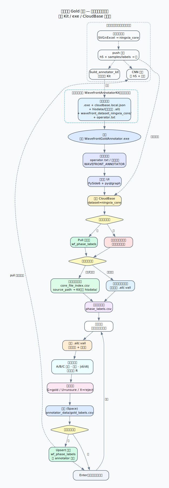

# 行波波头 Gold 标注工具

面向本仓库阶段 1（数据集 v2 重建）的人工复核客户端，用于建立 gold 标签集。
技术栈：`PySide6` + `pyqtgraph`，Windows / macOS / Linux 通用。

当前默认联立 CloudBase 拓扑核心集 `ningxia_core`：启动拉取云标签，保存时写入本地 `annotator_data/gold_labels.csv` 并 upsert 云端。

## 软件流程图



- 源文件：[`annotator_software_flowchart.dot`](../docs/reports/annotator_software_flowchart.dot)
- PNG：[`annotator_software_flowchart.png`](../docs/reports/annotator_software_flowchart.png)


## 功能

| 功能 | 说明 |
|---|---|
| 目录选择 | 递归扫描所选目录下全部 `.all` / `.vall` 录波文件 |
| 核心拓扑集 | 工具栏「加载核心拓扑集」：按 `core_file_index.csv` 解析路径（支持 Kit 内相对 `hisdata/`） |
| 云同步 | 启动 Pull / 保存 Upsert `wf_phase_labels`；密钥放 exe 旁 `cloudbase.local.json`（不入库） |
| 标注员 | `operator.txt` 或环境变量 `WAVEFRONT_ANNOTATOR` |
| 波形可视化 | **ABC 单窗切换**：主图同一时刻只显示活动相；下方相按钮或 `1/2/3` 换相 |
| 卡尺标注 | 每相一条可拖动红色卡尺，双击落点，←/→ 逐点微调（Shift 步长 10） |
| 框线区间 | `R` 键在卡尺附近开/关 `LinearRegionItem` |
| 导数辅助 | 可叠加 &#124;di/dt&#124; 曲线，辅助定位波头突变沿 |
| 自动标签对照 | 可加载 `phase_labels.csv` / `review_queue.csv` / `stage0_worst30.csv` |
| CSV 同步 | 每次保存原子写入 `annotator_data/gold_labels.csv`，主键 `(file_name, phase)` upsert |
| 应用图标 | 开发运行与打包产物共用 `wavefront_annotator/assets/app_icon.*` |

## 安装与启动

推荐使用 conda（macOS / Windows 通用，环境名 `pyqt`）：

```bash
cd annotation_tool
conda env create -f environment.yml
```

macOS 启动：

```bash
./run_annotator.sh /path/to/录波目录
```

Windows 启动：双击 `run_annotator.bat`（自动优先使用 conda `pyqt` 环境，无 conda 时回退 `.venv`）。

不用 conda 时的 venv 方式（Windows）：

```bat
cd annotation_tool
python -m venv .venv
.venv\Scripts\pip install -r requirements.txt
run_annotator.bat
```

## 打包与便携 Kit

```bash
# 仅 exe（含云模块）
build_annotator.bat

# exe + 相对路径索引 + 核心 .all → dist/WavefrontAnnotatorKit/
build_annotator_kit.bat
```

Kit 目录结构（整夹分发，**勿拆开**）：

```text
WavefrontAnnotatorKit/
  WavefrontGoldAnnotator.exe
  cloudbase.local.json      # 本地放置，勿提交 Git
  operator.txt
  hisdata/                  # 核心集 .all（相对路径）
  wavefront_dataset_ningxia_core/
  annotator_data/
```

`dist/` 与 Kit 大文件已被 `.gitignore` 排除，不会推送到远程。

命令行直接指定目录与参考 CSV：

```bat
.venv\Scripts\python -m wavefront_annotator D:\录波数据 ^
  --auto-labels ..\data\derived\wavefront_dataset_v1\phase_labels.csv ^
  --auto-labels ..\data\derived\wavefront_dataset_v1\review_queue.csv ^
  --auto-labels ..\wavefront_stage0_analysis\stage0_worst30.csv
```

## 快捷键

| 按键 | 动作 |
|---|---|
| `1` / `2` / `3` 或点击相按钮 | 切换主图显示的活动相 A / B / C |
| 双击波形 | 在该相放置卡尺 |
| `←` / `→`（`Shift` 加速） | 卡尺逐点微调 |
| `G` / `U` / `X` | 活动相状态设为 gold / unsure / reject |
| `R` | 框线区间开/关 |
| `Z` | 缩放到活动相卡尺附近 |
| `Home` | 复位视图 |
| `Space` | 保存当前文件标注 |
| `Enter` | 保存并跳到下一个文件 |
| `PgUp` / `PgDn` | 上/下一个文件 |

## gold_labels.csv 字段

| 列 | 含义 |
|---|---|
| `file_name` / `file_path` / `phase` | 主键与来源 |
| `gold_wavefront_index` | 人工确认的波头位置（**原始录波采样点坐标**，非窗口坐标） |
| `gold_time_us` | 对应时刻（µs），按 GPS 频率字段换算 |
| `region_start_index` / `region_end_index` | 框线区间（可空） |
| `status` | `gold` / `unsure` / `reject` |
| `auto_wavefront_index` | 自动伪标签位置，供审计对比 |
| `sampling_rate_hz` / `annotator` / `updated_at` | 换算依据与审计信息 |

## 标注流程建议（对接优化方案阶段 1）

1. 编辑 `operator.txt` 为本人名字；启动后确认状态栏云联立成功。
2. 默认加载核心拓扑集；必要时工具栏「拉取云标签」刷新。
3. 优先标注高优先级文件；打开导数辅助，双击首个陡峭突变沿，微调卡尺。
4. 波头清晰 → `G`；多候选难以判定 → `U` 并用 `R` 圈定候选区间；坏波形/无波头 → `X`。
5. `Enter` 保存并进入下一个文件；本地 CSV 与云端同步落盘。

## 测试

```bash
python tests/test_smoke.py
```

覆盖：`gold_labels.csv` upsert 往返；如果本地存在 `tests/sample_data/` 和数据集标签表，则额外执行解码器数值校验、主窗口离屏加载与保存。
