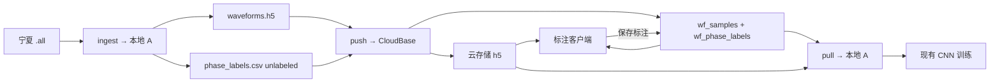

# 波头标注云同步对接大纲（方案 A + 腾讯云 CloudBase）

状态：大纲已通过；**P1/P2 已完成**  
范围：宁夏 `.all` → 本地 `h5+csv` → CloudBase 同步 → 标注回写 → 导出训练  
P1：`scripts/ingest_ningxia_to_local_a.py` → `data/derived/wavefront_dataset_ningxia_a/`  
P2：`scripts/push_local_a_to_cloudbase.py` / `pull_cloudbase_to_local_a.py`；说明见 `docs/reports/cloudbase_setup_cn.md`  
P2 默认后端：`local_mirror`（无账号可验往返）；真云将 `backend` 改为 `cloudbase` 并填密钥

---

## 0. 目标与边界


| 项        | 约定                                                                       |
| -------- | ------------------------------------------------------------------------ |
| 本地训练格式   | **A**：`waveforms.h5` + `phase_labels.csv`（与现 `WavefrontDataset` 对齐）      |
| 云端       | 腾讯云 **CloudBase**（上海或广州），大陆直连                                            |
| 云端波形     | **窗后** `float32`，默认 `L=8192`，统一 `fs_target=1.25e6`；**不**把采样序列写入 CSV/文档字段 |
| 未标注      | `phase_labels.status` / 云表 `label_status` 为空或 `unlabeled`                |
| 非目标（本阶段） | 测距、线路长度、多人冲突合并的完整 OT；仅做「最后写入获胜 + updated_at」                             |


宁夏集规模（验收用）：2394 事件，窗后 h5 ≈ 235 MB，标签行 ≈ 7182。

---

## 1. 目录与模块划分

```text
annotation_tool/
  wavefront_annotator/          # 现有客户端（后续加同步适配器）
  sync/                         # 新建：CloudBase 客户端薄封装
    cloudbase_client.py
    models.py                   # 与云表字段一一对应的 dataclass
scripts/                        # 或 annotation_tool/scripts/
  ingest_ningxia_to_local_a.py  # .all → 本地 waveforms.h5 + phase_labels.csv
  push_local_a_to_cloudbase.py  # 本地 A → 云存储 + 云数据库
  pull_cloudbase_to_local_a.py  # 云 → 本地 A（训练导出）
docs/reports/
  cloudbase_sync_outline.md     # 本文件
data/derived/wavefront_dataset_ningxia_a/   # 本地产物（gitignore）
  waveforms.h5
  phase_labels.csv
  manifest.csv                  # 可选：事件级清单
```

---

## 2. 本地格式 A（训练侧，不变语义）

### 2.1 `waveforms.h5`


| 项   | 值                                                                           |
| --- | --------------------------------------------------------------------------- |
| 数据集 | `/signals`，形状 `[N, 3, 8192]`，`float32`                                      |
| 属性  | `target_sampling_rate_hz=1.25e6`，`window_samples=8192`，`coord_space=window` |
| 索引  | 第 0 维 = `sample_index`（与 csv 对齐）                                            |


### 2.2 `phase_labels.csv`（扩展现训练强制列）


| 列                        | 用途                                                            | 未标注时          |
| ------------------------ | ------------------------------------------------------------- | ------------- |
| `sample_index`           | 指向 h5                                                         | 有值            |
| `sample_id`              | 稳定哈希/业务 ID                                                    | 有值            |
| `phase`                  | A/B/C                                                         | 有值            |
| `window_wavefront_index` | 窗内波头                                                          | **-1** 表示无标签  |
| `confidence`             | 置信度                                                           | 0             |
| `label_status`           | `unlabeled` / `gold` / `unsure` / `reject` /（兼容）`hard`/`soft` | `unlabeled`   |
| `split_event`            | train/val/test                                                | 入库时可先空或按规则预划分 |
| `file_name`              | 溯源 `.all`                                                     | 有值            |
| `raw_wavefront_index`    | raw 坐标（可选）                                                    | 空             |
| `sampling_rate_hz_src`   | 源录波采样率                                                        | 有值            |
| `cloud_object_key`       | 云存储对象键（同步后填）                                                  | 可空            |
| `updated_at`             | ISO 时间                                                        | 有值            |


训练过滤：现有逻辑已要求 `window_wavefront_index >= 0` 且 `label_status ∈ {hard,soft}`；导出训练子集时只拉 `gold`（映射为 `hard`）或显式配置。

---

## 3. CloudBase 云端模型

### 3.1 云存储（Cloud Storage）


| 对象键                                          | 内容                  |
| -------------------------------------------- | ------------------- |
| `wavefront/ningxia/signals/waveforms.h5`     | 整库 h5（推荐首版：一次上传，简单） |
| 或 `wavefront/ningxia/events/{sample_id}.npz` | 单事件原子包（二期：增量友好）     |


首版选型：**整库 h5 + 标签文档**（实现最快；宁夏 235 MB 可接受）。  
二期再拆事件 npz，降低并发标注时的下载粒度。

### 3.2 集合 `wf_samples`（事件级）


| 字段               | 类型     | 说明            |
| ---------------- | ------ | ------------- |
| `_id`            | string | = `sample_id` |
| `dataset`        | string | 如 `ningxia`   |
| `file_name`      | string | 原 `.all` 名    |
| `sample_index`   | number | h5 行号         |
| `window_samples` | number | 8192          |
| `target_fs_hz`   | number | 1.25e6        |
| `source_fs_hz`   | number | 625k / 1.25M  |
| `storage_key`    | string | h5 或 npz 键    |
| `split_event`    | string | 可空            |
| `created_at`     | string | ISO           |
| `updated_at`     | string | ISO           |


### 3.3 集合 `wf_phase_labels`（相级，标注主表）


| 字段                       | 类型     | 说明                                   |
| ------------------------ | ------ | ------------------------------------ |
| `_id`                    | string | `{sample_id}:{phase}`                |
| `sample_id`              | string |                                      |
| `phase`                  | string | A/B/C                                |
| `window_wavefront_index` | number | 无标签 = -1                             |
| `raw_wavefront_index`    | number | null                                 |
| `region_start_index`     | number | null                                 |
| `region_end_index`       | number | null                                 |
| `label_status`           | string | `unlabeled`/`gold`/`unsure`/`reject` |
| `annotator`              | string |                                      |
| `note`                   | string |                                      |
| `updated_at`             | string | ISO；冲突时比较此字段                         |
| `rev`                    | number | 单调版本，客户端每次 +1                        |


安全规则（原则）：

- 登录用户可读本数据集；
- 仅认证用户可写 `wf_phase_labels` 的标签字段；
- 禁止客户端改写 `sample_index` / `storage_key`（或仅管理员云函数可写）。

---

## 4. 流水线（三脚本）




| 步骤     | 脚本                             | 输入                        | 输出                      | 验收                                                       |
| ------ | ------------------------------ | ------------------------- | ----------------------- | -------------------------------------------------------- |
| 1 入库本地 | `ingest_ningxia_to_local_a.py` | `宁夏数据/hisdata/**/*.all`   | 本地 A 目录                 | `signals.shape[0]==2394`；csv 行数≈7182；`unlabeled` 占满      |
| 2 推云   | `push_local_a_to_cloudbase.py` | 本地 A + CloudBase 环境 ID/密钥 | 云存储对象 + 两集合文档           | 控制台可见 2394 samples / 7182 labels                         |
| 3 标注   | 客户端扩展（薄）                       | 拉未标注列表；本地可仍读 h5 或缓存       | PATCH `wf_phase_labels` | 保存后云端 `label_status=gold` 且 `updated_at` 更新              |
| 4 拉训   | `pull_cloudbase_to_local_a.py` | 云端                        | 覆盖/合并本地 csv；h5 若未变可跳过下载 | `label_status=gold` 可被 `build_phase_index` 消费（映射 `hard`） |


物理/时基规则（入库强制）：

1. 源 `fs` 读自 `.all` GPS 频率字段；
2. 重采样到 `1.25e6`（短录波 625 kHz → 上采样）；
3. 按与现网一致的 common-crop / 固定物理窗策略裁到 8192（实现时对齐 FaultLocation_demo 或现 v1 builder；**不得静默改坐标语义**）；
4. 标签一律 `window` 坐标；若客户端仍标 raw，保存前做映射。

---

## 5. 客户端同步点（改动最小）

现有 `GoldLabelStore` 继续写本地 `gold_labels.csv`（崩溃兜底）。  
新增 `CloudLabelSync`（可选开关）：


| 时机                     | 动作                                                           |
| ---------------------- | ------------------------------------------------------------ |
| 启动且已配置环境               | 拉取 `label_status in (unlabeled,unsure)` 队列，按 `updated_at` 排序 |
| `save_current` / Enter | 本地 upsert 成功后，异步 PATCH 对应 `wf_phase_labels`                  |
| 冲突                     | 若云端 `rev` > 本地，提示并采用云端或强制覆盖（配置项）                             |
| 离线                     | 只写本地；联网后批量 `push_pending`                                    |


首版可不改 UI 布局，仅在状态栏显示「已同步 / 待同步 / 失败」。

---

## 6. 鉴权与密钥


| 项    | 约定                                                                                      |
| ---- | --------------------------------------------------------------------------------------- |
| 客户端  | CloudBase Web/HTTP SDK + 登录（用户名密码或自定义登录）                                                |
| 脚本推送 | 服务端密钥 / 云函数管理员权限；**禁止**把管理员密钥打进 exe                                                     |
| 配置   | `annotation_tool/sync/cloudbase.local.json`（gitignore）+ 环境变量 `TCB_ENV` / `TCB_SECRET`_* |


---

## 7. 实施阶段与验收


| 阶段  | 交付                                       | 完成标准                          |
| --- | ---------------------------------------- | ----------------------------- |
| P0  | 本大纲确认                                    | 你回复「大纲通过」                     |
| P1  | `ingest_ningxia_to_local_a.py` + 本地 A 产物 | 宁夏 2394 条 h5/csv 自检通过         |
| P2  | CloudBase 集合创建说明 + `push`/`pull` 脚本      | 手动 push 后控制台数据齐全；pull 可还原 csv |
| P3  | 客户端 `CloudLabelSync` 开关                  | 标注一条 → 云端可见 → pull 后训练索引含该条   |
| P4  | 文档：开通 CloudBase、安全规则、gitignore           | README 一节即可                   |


---

## 8. 风险与非目标


| 风险                    | 缓解                                  |
| --------------------- | ----------------------------------- |
| 免费点耗尽（全量反复下 h5）       | 本地缓存 h5；日常只同步标签文档                   |
| 625 kHz / 1.25 MHz 混库 | 入库强制重采样；csv 保留 `source_fs_hz`       |
| 窗裁剪与旧 v1 不一致          | 与现有 builder/文档对齐后再 ingest；单测对比 10 条 |
| exe 泄露密钥              | 仅用户登录态；推库用独立脚本                      |


---

## 9. 待你确认的细节（默认值已选）


| 项      | 默认                         | 可选             |
| ------ | -------------------------- | -------------- |
| 云存储粒度  | **整库 h5**                  | 事件 npz         |
| 训练标签映射 | 云端 `gold` → 本地 `hard`      | 增加 `soft` 规则   |
| 窗裁剪策略  | **对齐现有 v1 / demo builder** | 固定故障时刻中心窗（需另定） |
| 登录     | CloudBase 用户名密码            | 仅脚本同步、客户端暂离线   |


---

确认方式：回复 **「大纲通过」**（如需改默认项请一并写出）。通过后从 **P1 入库脚本** 开始实现。