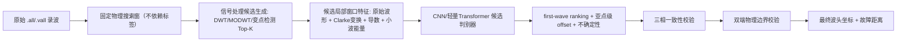

# 波头检测优化可行性方案

生成日期：2026-07-15
基于：`wavefront_cnn_colab_all_in_one.ipynb` 运行结果 + 《波头 CNN 训练结果与根因分析》+ 代码复核

---

## 0. 结论先行

1. **技术路线不需要换成强化学习**。当前任务本质是"候选事件检测 + 排序判别"的结构化预测问题，CNN／判别式模型在理论和工程上都能覆盖，问题不出在模型族选择上，而出在监督目标（伪标签）、输入构造（标签依赖裁剪）、解码规则（argmax 与训练目标不一致）三个环节。
2. 可行性判断：**在数据和任务定义修正之后，用 CNN（或同量级判别式网络）继续做，技术上可行，且性价比高于引入 RL**。
3. 本方案分五个阶段，核心原则是"先诊断、后重建、再判别排序、最后加物理约束"，每阶段都有独立可验收的产出，不要求一次性推倒重来。

---

## 1. 强化学习 vs CNN：技术路线选型分析

### 1.1 先看任务的真实结构

把"从一段波形里找到初始行波波头"拆解后，它包含三个子问题：

| 子问题 | 数学形式 | 特征 |
|---|---|---|
| 候选发现 | 从原始波形中提出若干个"可能是波头"的时间点 | 一次性、可并行、有明确输入输出 |
| 候选判别/排序 | 判断每个候选是否为真实首波，并给出置信度排序 | 静态分类/排序问题，标签在训练时已知 |
| 精细定位 | 在候选点附近做亚采样点级偏移回归 | 局部回归，标签在训练时已知 |

这三步全部是**监督学习范畴内的结构化预测问题**：输入是波形，输出是候选集合及其排序/坐标，训练时刻就已经有（哪怕有噪声的）标签可以直接算损失、直接反向传播。不存在"模型需要先做出一个动作，环境才会给出下一步观测和延迟奖励"这种序列决策结构。

### 1.2 RL 适用的场景 vs 本任务对照

| RL 真正擅长解决的问题特征 | 本任务是否具备 |
|---|---|
| 决策是多步的，当前动作影响未来状态（环境有状态转移） | 否——单次前向输出坐标，不存在"动作改变环境"的闭环 |
| 目标函数不可微，或只能通过采样／模拟获得反馈（如游戏得分、物理仿真结果） | 否——坐标误差、分类交叉熵、排序损失全部可微，可以直接梯度下降 |
| 缺乏逐样本标签，只有稀疏的最终奖励信号 | 否——每个训练样本都有（哪怕带噪声的）时间坐标标签，是标准监督信号，比"稀疏奖励"信息量大得多 |
| 奖励函数本身容易设计且能准确反映目标 | 恰恰相反——本任务当前最大的痛点就是"真值都不可信"，如果换成 RL，等于要在同样不可信的标签基础上再设计一个奖励函数，问题不会变简单，只会多一层近似误差和调参黑箱 |

结论：**RL 不解决本任务的核心矛盾（伪标签质量、位置先验、解码规则不一致），反而会引入训练不稳定、样本效率低、奖励设计困难等新问题。** 这不是"CNN 能力不够所以要上强化学习"的场景，是"监督信号本身要先修好"的场景，RL 在这里没有议价空间。

### 1.3 RL（或类 RL 思路）真正可能有边际价值的地方

不是全盘否定 RL 相关的思想，以下几个点可以在监督学习框架里借鉴，但**不建议作为主线模型训练方式**：

- **主动学习/人工复核队列排序**：用 bandit 思路（不是完整 RL）给"最值得人工复核的样本"排优先级，加速 gold 集积累，属于工具层面，不涉及波头检测模型本身。
- **候选生成阈值的策略搜索**：如果候选生成规则（DWT/MODWT/变点检测的阈值）需要在"召回率"和"候选数量"之间调参，可以用简单的贝叶斯优化或网格搜索，没必要上 RL。
- **超参数调优**（学习率、损失权重）：常规 AutoML/贝叶斯优化即可，同样不需要 RL。

以上都是"锦上添花"级别的优化，不建议放在当前阶段的路线图里，避免分散资源。

### 1.4 技术上 CNN 能不能做到

能。行波波头检测本质接近计算机视觉里的"1D 时序目标检测 + 关键点定位"问题，业界有大量成熟范式可以直接借鉴（anchor-free 关键点检测、CenterNet 式峰值检测、learning-to-rank 排序损失、focal loss 处理正负样本不均衡等），都是判别式/监督式方法，不需要引入 RL。当前 CNN 效果不好，**根因在监督目标和输入构造，不在模型族**——这一点在之前的过拟合自检（32 样本 MAE 0.46）里已经验证：模型有能力拟合，只是拟合的目标本身不可靠。

---

## 2. 推荐技术路线（沿用并细化候选排序思路）

关键设计原则：

- **训练和推理使用同一套候选生成规则**，候选生成不依赖任何标签信息，消除位置先验。
- **判别头输出 `p_first`（是否为首波）+ `offset`（细定位）+ `uncertainty`**，损失函数里排序损失（真实首波分数 > 反射波/强脉冲/噪声）与坐标回归损失联合训练，避免"训练用软期望、推理用硬 argmax"的不一致（即上次代码复核指出的问题）。
- **三相和双端约束作为训练期的辅助损失或后处理硬校验**，不是可选项。

---

## 3. 分阶段实施计划

### 阶段 0：低成本诊断（0.5～1 人周，不改数据不改模型）

目的：在投入数据重建前，先用数字验证"标签质量是主因"这个假设，估算后续投入的收益上限。

| 任务 | 产出 | 验收标准 |
|---|---|---|
| 用 `audit_report.json` 现有标记（跨相 spread>64、导数证据弱）对当前 test 预测结果分层 | 分层 MAE/P95/Acc@4 对比表 | 干净子集 vs 风险子集误差差异有统计意义 |
| 检查当前 test 集"最差 30 个样本"是否命中已知风险标记 | 命中率统计 | 命中率显著高于风险样本在全集中的占比，即可确认标签是主因 |
| 复核 loss/decode 不一致问题：统计"分类头选错粗 bin"的样本比例，及其误差量级 | 选错 bin vs 选对 bin 两类误差分布对比 | 验证"选错候选即误差跳变"假设 |

**Go/No-Go**：如果诊断确认标签质量和候选选择错误是主要误差来源（预期结果），进入阶段 1；如果诊断显示误差主要来自选对候选后的 offset 精度问题，则可以跳过阶段 1，直接优化阶段 3 的判别/排序结构。

### 阶段 1：数据集 v2 重建（2～4 人周，含人工复核）

| 任务 | 产出 | 验收标准 |
|---|---|---|
| 标签分层：gold（人工复核+双端物理校验）/ silver（严格自动标注）/ review | 分层后的标签表 | gold 样本 200～600 个事件级样本 |
| 取消标签依赖裁剪，改为固定物理搜索窗或滑窗候选 | 新的输入构造流程，训练/推理一致 | 抽查 50 个样本，输入窗口与标签位置无系统性相关 |
| 三相一致性 + 双端物理反校验规则 | 校验脚本 + 违规样本清单 | 覆盖当前全部 hard/soft 标签 |

### 阶段 2：候选生成与召回验证（1～2 人周）

| 任务 | 产出 | 验收标准 |
|---|---|---|
| 实现候选生成（DWT/MODWT/变点检测 Top-K） | 候选生成模块 | candidate recall@K on gold ≥ 99% |
| 候选数量/召回率权衡分析 | 阈值选择报告 | 平均候选数控制在可训练范围内（如 ≤ 16） |

**Go/No-Go**：候选召回率达不到 99%，判别器训练得再好也没有意义，必须先在这一步达标才能往下走。

### 阶段 3：候选判别/排序模型训练（2～3 人周）

| 任务 | 产出 | 验收标准 |
|---|---|---|
| 判别器结构设计（复用当前 ResNet 骨干，改输出头为 `p_first`+`offset`+`uncertainty`） | 模型代码 | 通过 32 样本过拟合自检 |
| 排序损失 + offset 损失联合训练，修复 train/inference 不一致 | 训练脚本 | 分类头 argmax 命中的 bin，offset 头在该 bin 上有充分梯度覆盖（可用梯度范数或验证误差间接验证） |
| gold 验证集上的模型选择（替换当前"用同分布伪标签选 checkpoint"的方式） | 训练报告 | Acc@4 on gold ≥ 90%，目标 ≥ 95% |

### 阶段 4：物理约束与工程验收（1～2 人周）

| 任务 | 产出 | 验收标准 |
|---|---|---|
| 三相一致性检查接入推理流程 | 推理后处理模块 | 三相首波时间容差内一致率达标 |
| 双端物理边界校验（时间差落入 `[0, L]`，方向一致） | 推理后处理模块 | 物理边界违规率接近 0 |
| 分层评估（event split / line split / 采样率分层 / 波形类型分层） | 评估报告 | line split 性能不显著劣于 event split |
| 双端测距误差与现有信号处理基线对比 | 对比报告 | 优于现有基线 |

---

## 4. 总体时间线（人力按 1 名算法工程师全职估算，可并行压缩）

| 阶段 | 预计工时 | 关键产出 | 是否可跳过 |
|---|---|---|---|
| 0 低成本诊断 | 0.5～1 周 | 量化标签质量对误差的贡献 | 不建议跳过，成本极低 |
| 1 数据集 v2 | 2～4 周 | gold/silver 分层数据 | 不可跳过 |
| 2 候选生成 | 1～2 周 | candidate recall ≥ 99% | 不可跳过 |
| 3 判别排序模型 | 2～3 周 | Acc@4 ≥ 90%（gold） | 不可跳过 |
| 4 物理约束与验收 | 1～2 周 | 双端测距误差优于基线 | 不可跳过 |
| **合计** | **约 7～12 周** | | |

---

## 5. 风险与缓解

| 风险 | 影响 | 缓解措施 |
|---|---|---|
| gold 样本人工复核工作量被低估 | 阶段 1 延期 | 先做 200 个事件级样本验证流程，再决定是否扩到 600 |
| 候选生成召回率达不到 99% | 后续判别器训练失去意义 | 允许候选生成规则本身迭代 2～3 轮，必要时放宽 K 值 |
| 三相/双端约束数据量不足（当前仅 175 对，90 个物理有效） | 双端监督样本稀疏，约束项训练不稳定 | 优先作为后处理硬校验而非训练期软约束，降低对样本量的依赖 |
| 阶段 0 诊断结果与预期不符（误差主因不是标签） | 需要重新定位问题 | 阶段 0 设计了明确的 Go/No-Go 判据，提前暴露该风险 |

---

## 6. 验收门槛（沿用并作为项目结项标准）

| 指标 | 门槛 | 目的 |
|---|---:|---|
| candidate recall@K on gold | ≥ 99% | 确保真实波头没有被候选生成漏掉 |
| Acc@4 samples on gold | ≥ 90%，目标 ≥ 95% | 验证细粒度波头定位 |
| P95 error on gold | ≤ 8 统一采样点 | 控制工程尾部风险 |
| catastrophic error > 64 samples 占比 | < 1% | 防止跳到反射波或后续大脉冲 |
| line split 性能 | 不显著劣于 event split | 验证未知线路泛化 |
| 双端测距误差 | 优于现有信号处理基线 | 证明最终工程收益 |
| 物理边界违规率 | 接近 0 | 避免距离落到线路外或端点方向错误 |

---

## 7. 一句话总结

技术路线上，**候选生成 + CNN 判别排序 + 物理约束后处理**是可行的、有成熟范式支撑的方案，不需要引入强化学习；当前指标差的根因是监督目标和输入构造问题，不是模型能力问题。建议按阶段 0→4 推进，阶段 0 成本极低但能提前验证核心假设，是性价比最高的第一步。
